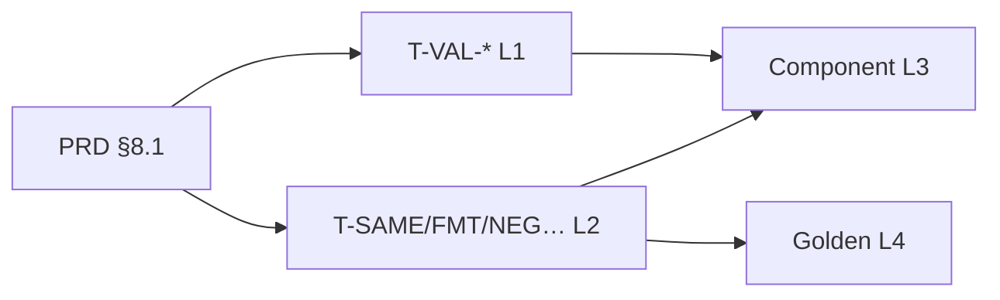

# UnitConverter_03 — 테스트 플랜

| 항목 | 내용 |
|------|------|
| **SSOT** | [PRD.md](PRD.md) §4 · §5 · §6 · §8 |
| **버전** | 0.2 |
| **작성일** | 2026-06-11 |
| **범위** | PRD §8.1 7건 · SC-1~3 · F1~F3 · Boundary 보완(T-VAL-*) |

---

## 1. 목적

Mom Test에서 확인한 **F1~F3**를 pytest로 고정하고, PRD **SC-1~3**·**FR-6~12**를 자동 검증한다.

| Mom Test 증거 | 실패 조건 | 성공 기준 | 대표 Test ID |
|---------------|-----------|-----------|--------------|
| `8.2021` vs `8.2` 3회 재실행 | **F1** | **SC-2** | T-FMT-01 · T-VAL-PASS-01 |
| `meter:-2.5` 무차단 | **F2** | **SC-3** | T-NEG-01 |
| 동일 입력 출력 불안 | **F3** | **SC-1** | T-SAME-01 |

**범위 밖:** GUI · JSON/CSV/표 · cubit · 설정 외부화 (PRD §7)

---

## 2. PRD §8.1 — 테스트 카탈로그 (SSOT)

PRD §8.1 표를 **1:1** 따른다. Given·Then은 §6.2·§6.3으로 구체화한다.

| Test ID | FR | SC | Given | When | Then (Assert) |
|---------|-----|-----|-------|------|---------------|
| **T-SAME-01** | FR-12 | SC-1 | `meter:2.5` | CLI **2회** 연속 실행 | 두 stdout **바이트 동일** (`==`) |
| **T-FMT-01** | FR-3,10 | SC-2 | `meter:2.5` | CLI 1회 | §6.2 **3줄** · `8.2 feet` · `2.7 yard` 포함 |
| **T-NEG-01** | FR-8 | SC-3 | `meter:-2.5` | CLI 1회 | 변환 줄 **없음** · 음수 오류(§6.3) |
| **T-FMT-ERR** | FR-6 | SC-3 | `meter` | CLI 1회 | `Invalid format. Use unit:value (ex: meter:2.5)` |
| **T-NUM-ERR** | FR-7 | SC-3 | `meter:abc` | CLI 1회 | `Invalid number: abc` |
| **T-UNIT-ERR** | FR-9 | SC-3 | `inch:1` | CLI 1회 | `Unknown unit: inch` |
| **T-CONV-FT** | FR-4,5 | — | `feet:8.2` | CLI 1회 | meter·yard 줄 출력 · **3단위 전부** |

### §6.2 Golden 출력 (T-FMT-01 · SC-2)

```
2.5 meter = 2.5 meter
2.5 meter = 8.2 feet
2.5 meter = 2.7 yard
```

- 줄 형식: FR-11 `{value} {unit} = {converted} {target_unit}`
- 정밀도: FR-10 — meter 입력값 유지 · feet/yard 소수 **1자리**
- 비율: FR-3 · FR-15 — `3.28084` · `1.09361` (`constants.py` SSOT). **SC-2 맞추기 하드코딩 금지** (§8.2)

---

## 3. 테스트 계층

PRD §8.1은 **CLI Given**(`unit:value`)이다. Harness는 **Boundary `validate_lines(grid)`** 로 SC-2·grid를 먼저 고정한다.

| 계층 | Layer | SUT | 테스트 파일 | PRD 근거 |
|------|-------|-----|-------------|----------|
| **L1 Boundary** | boundary | `validate_lines(grid)` | `tests/test_validate_lines.py` | `.cursorrules` API · FR-10~11 |
| **L2 CLI** | boundary | `UnitConverter.py` `main()` | `tests/test_cli.py` | §6.1~6.3 · §8.1 |
| **L3 Component** | entity | `parse` / `validate` / `convert` / `format` | `tests/test_*.py` | §6.4 · FR-14 (REFACTOR) |
| **L4 Golden** | — | fixture 대비 | `tests/test_golden_master.py` | SC-1~2 바이트 고정 |



| SC | L1 (grid) | L2 (CLI) |
|----|-----------|----------|
| **SC-1** | — (1회 grid 판정) | T-SAME-01 |
| **SC-2** | T-VAL-PASS/FAIL-01 | T-FMT-01 |
| **SC-3** | — (오류 입력 비범위) | T-NEG-01 · T-FMT/NUM/UNIT-ERR |

---

## 4. Boundary 보완 — T-VAL-* (Harness)

PRD §8.1에 없으나 `.cursorrules` · `tdd-red.md` 계약. **SC-2 / F1** grid 검증.

| Test ID | Given (grid) | When | Then |
|---------|--------------|------|------|
| **T-VAL-PASS-01** | §6.2 정답 3줄 | `validate_lines(grid)` | `status=="pass"`, `failed_lines==[]` |
| **T-VAL-FAIL-01** | feet 줄 `8.2021` (Mom Test F1) | 동일 | `status=="fail"`, 해당 줄 ∈ `failed_lines` |
| **T-VAL-INC-01** | `[]` | 동일 | `status=="incomplete"`, `failed_lines==[]` |
| **T-VAL-INC-02** | 1~2줄 (3단위 미만) | 동일 | `status=="incomplete"` |

grid 형식: `{value} {unit} = {converted} {target}` (`.cursorrules`)

---

## 5. 케이스별 상세 플랜

### 5.1 T-FMT-01 / T-VAL-PASS-01 — SC-2, F1

| 항목 | L2 CLI | L1 Boundary |
|------|--------|-------------|
| **함수명** | `test_fmt_meter_sc2` | `test_sc2_valid_grid_passes` |
| **Arrange** | stdin `"meter:2.5\n"` | grid = §6.2 3줄 리터럴 |
| **Act** | `main()` 또는 subprocess | `validate_lines(grid)` |
| **Assert** | stdout == GOLDEN §6.2 | `result["status"]=="pass"` |
| **RED 실패** | feet `8.2021` 등 | stub `...` · AssertionError |
| **Invariant** | FR-3 비율 · FR-10 1자리 | 동일 |

### 5.2 T-NEG-01 — SC-3, F2

| 항목 | 내용 |
|------|------|
| **Given** | `meter:-2.5` |
| **Assert +** | stdout에 `= 8.2 feet` / `= 2.7 yard` **없음** |
| **Assert +** | `Negative value not allowed: -2.5` (§6.3 — 구현 시 문구 고정) |
| **계층** | L2 CLI only |

### 5.3 T-SAME-01 — SC-1, F3

| 항목 | 내용 |
|------|------|
| **Given** | `meter:2.5` |
| **Act** | 동일 입력 2회 (PRD); Mom Test는 3회였으나 2회로 결정성 충분 |
| **Assert** | `out1 == out2` (바이트) |
| **Golden 연계** | `/golden-master` → `GM-SC1-BYTES` |
| **계층** | L2 CLI only |

### 5.4 T-FMT-ERR · T-NUM-ERR · T-UNIT-ERR — SC-3

| Test ID | Given | Then (전문) | 변환 출력 |
|---------|-------|-------------|-----------|
| T-FMT-ERR | `meter` | `Invalid format. Use unit:value (ex: meter:2.5)` | 없음 |
| T-NUM-ERR | `meter:abc` | `Invalid number: abc` | 없음 |
| T-UNIT-ERR | `inch:1` | `Unknown unit: inch` | 없음 |

### 5.5 T-CONV-FT — FR-4, FR-5

| 항목 | 내용 |
|------|------|
| **Given** | `feet:8.2` |
| **Then** | 3줄 출력 — feet·meter·yard 각 1줄 이상 |
| **기대값** | SSOT 비율로 계산 (`8.2/3.28084` → meter 등) · **리터럴 하드코딩 금지** |
| **정밀도** | FR-10 — feet 입력 표시 · meter/yard 1자리 |

---

## 6. SC · F · FR 추적 매트릭스

| SC / F | Test ID | 계층 | Exit |
|--------|---------|------|------|
| **SC-1** / F3 | T-SAME-01, GM-SC1-BYTES | L2, L4 | 2회 출력 `==` |
| **SC-2** / F1 | T-FMT-01, T-VAL-PASS/FAIL-01, GM-SC2-METER | L1, L2, L4 | §6.2 3줄 |
| **SC-3** / F2 | T-NEG-01, T-FMT/NUM/UNIT-ERR | L2 | 변환 없음 + §6.3 |
| FR-4·5 | T-CONV-FT | L2 | 3단위 |
| FR-13 / F4 | REFACTOR 리뷰 | L3 | if/elif 최소 |

---

## 7. RED 우선순위 · ARRR 실행

### 7.1 Mom Test → RED 순서 (PRD §8.1 + Harness)

| 순서 | Test ID | ARRR Command 흐름 | Layer |
|------|---------|-------------------|-------|
| 1 | T-VAL-PASS-01 | `/red-test-plan` → `/red-skeleton` | boundary |
| 2 | T-VAL-FAIL-01 | 동일 | boundary |
| 3 | T-FMT-01 | `/red-skeleton` → `/green-minimal` | boundary→CLI |
| 4 | T-NEG-01 | 동일 | CLI |
| 5 | T-SAME-01 | 동일 + `/golden-master` | CLI |
| 6 | T-FMT/NUM/UNIT-ERR | 동일 | CLI |
| 7 | T-CONV-FT | 동일 | CLI |
| 8 | T-VAL-INC-* | 동일 | boundary |
| 9 | — | `/refactor-smell` → `/refactor-safe` | entity |

**1 RED 사이클 = Test ID 1건** (PRD §8.2)

### 7.2 ARRR ↔ Phase

| ARRR | Command | 변경 허용 |
|------|---------|-----------|
| **A** (Ask) | `/red-test-plan` | 없음 |
| **R** (Red) | `/red-skeleton` | `tests/` |
| **G** (Green) | `/green-minimal` | `src/` |
| **G+** | `/golden-master` | `tests/fixtures/` · conftest |
| **R** (Refactor) | `/refactor-smell` / `/refactor-safe` | smell: 없음 / safe: `src/` |

### 7.3 TDD 규칙 (PRD §8.2)

| Phase | 허용 | 금지 |
|-------|------|------|
| RED | `tests/` | `src/` 수정 |
| GREEN | `src/`, `UnitConverter.py` | `tests/` assert 완화 |
| REFACTOR | `src/` (동작 동일) | TC green 깨뜨리기 |

**공통 금지:** assert 완화 · `skip` · `xfail` · SC-2 **비율 하드코딩**

---

## 8. 파일 · fixture · pytest

### 8.1 테스트 파일 배치

| 파일 | Test ID | 비고 |
|------|---------|------|
| `tests/test_validate_lines.py` | T-VAL-* | L1 · import `validate_lines` |
| `tests/test_cli.py` | T-SAME/FMT/NEG/… | L2 · subprocess 또는 `main` 래퍼 |
| `tests/test_golden_master.py` | GM-SC1 · GM-SC2 | L4 · `/golden-master` |
| `tests/conftest.py` | — | `valid_sc2_grid`, `run_cli` |

### 8.2 Golden fixture (`/golden-master`)

| Golden ID | 경로 | SSOT |
|-----------|------|------|
| **GM-SC2-METER** | `tests/fixtures/golden_sc2_meter.txt` | PRD §6.2 3줄 |
| **GM-SC1-BYTES** | conftest 또는 테스트 내 상수 | T-SAME-01 2회 동일 + §6.2 선택 |

### 8.3 pytest 명령 (PRD §8.3)

```bash
# 전체
python -m pytest tests/ -v

# L1 Boundary
python -m pytest tests/test_validate_lines.py -v

# L2 CLI
python -m pytest tests/test_cli.py -v

# 단일 TC
python -m pytest tests/test_validate_lines.py::test_sc2_valid_grid_passes -v
```

| 항목 | 값 |
|------|-----|
| Runner | pytest |
| `pythonpath` | `src` (`pyproject.toml`) |
| AAA | `# Arrange` / `# Act` / `# Assert` 주석 필수 |

### 8.4 ECB · Mock (Logic Track)

| 규칙 | 내용 |
|------|------|
| 의존 | Test → Boundary/Component → Entity |
| Domain Mock | **금지** — grid · `unit:value` 리터럴 |
| 오류 표현 | PRD §6.3 문자열 또는 ValidationResult · E001~E005 emit 금지 |

---

## 9. Exit Criteria

- [ ] PRD §8.1 **7 Test ID** green (L2)
- [ ] **T-VAL-*** 4건 green (L1)
- [ ] **SC-1~3** 각 1+ 자동 테스트
- [ ] **GM-SC2-METER** · SC-1 바이트 golden
- [ ] `python -m pytest tests/ -v` 전체 pass
- [ ] F1~F3 Mom Test 수동 확인 → pytest로 **대체**됨
- [ ] PRD §8.2 금지 위반 없음
- [ ] FR-13·14 REFACTOR smell 처리 또는 잔여 문서화

---

## 10. 참고

| 문서 | 내용 |
|------|------|
| [PRD.md](PRD.md) | §8.1 Test ID · FR · SC · §6 입출력 |
| [.cursorrules](../.cursorrules) | grid · API · ECB · SC 불변식 |
| [.cursor/skills/magic-square-tdd/SKILL.md](../.cursor/skills/magic-square-tdd/SKILL.md) | ARRR Command 체인 |
| [.cursor/commands/tdd-red.md](../.cursor/commands/tdd-red.md) | Boundary RED (레거시) |
| [.cursor/commands/red-test-plan.md](../.cursor/commands/red-test-plan.md) | RED ③ 설계 |

---

## 11. 변경 이력

| 버전 | 날짜 | 변경 |
|------|------|------|
| 0.1 | 2026-06-11 | 초안 — §8.1 · L1/L2 · Exit Criteria |
| 0.2 | 2026-06-11 | PRD §8.1 카탈로그 1:1 · ARRR · T-VAL-* · Golden · ECB |
